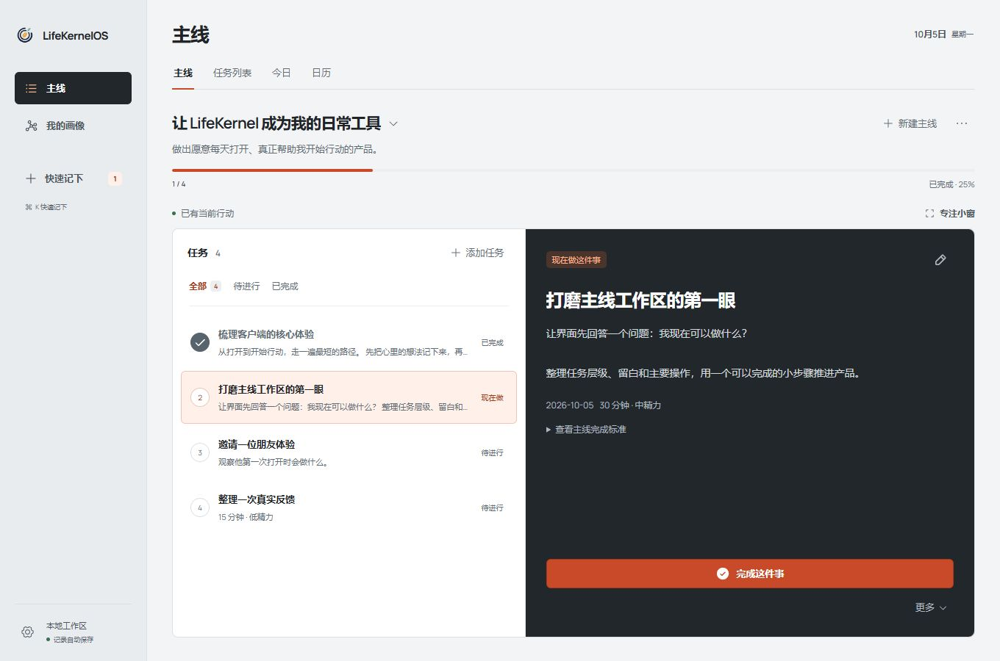

# LifeKernelOS

LifeKernelOS 是一个目标驱动的个人行动工具，让重要的事变成每天能开始的一步。基础 Todo 与日历本地可用；用户可配置自己的 API Key，用 AI 把任务拆成可执行的小步骤。

默认客户端使用 **Electron + React + TypeScript**。打开即可用，无需登录、部署服务或联网。记录保存在本机；主线进度来自完成事实。



## 本轮产品内容

- **主线**：多个方向、任务内容、派生进度与一个全局当前行动。支持完成、拆小、卡住、恢复、放弃和暂时放下。
- **基础 Todo**：新建与编辑、直接勾选、撤销完成、可恢复移除、搜索和主线/状态筛选。
- **日期与视图**：主线内切换任务列表、今日、月历和周历；选日新建，日期可清除，未安排任务仍可访问。
- **快速记下**：不必先分类，稍后再整理到主线。完整保留最多 2000 字符。
- **我的画像**：主线、完成事实、知识、自我描述和经历的可追溯图谱。
- **AI 任务拆解**：配置自己的 API Key，查看并编辑建议、选择采纳；保留来源与原日期，结果面板支持安全撤销。
- **桌面体验**：专注小窗、收集小窗、快捷键、自动保存、导出、确认后备份导入。
- **简约界面**：保留冷白、石墨黑与朱橙。紧凑页头、统一按钮层次，低频操作进入“更多”；时长与精力按需展开，任务详情选中后展示，小窗口仍可直接操作当前任务。

当前已接入用户 Key 的任务拆解，基础 Todo 与日历继续独立使用。AI 仅在用户请求时提供建议，须确认后才修改任务；不替用户判断人格、能力或人生优先级。体验参考见[官方产品调研](docs/product/todo-reference-products.md)。

## 启动桌面客户端

需要 Node.js 22.13 或以上，建议 Node.js 24 LTS，以及桌面图形环境。

```bash
npm ci
npm run dev
```

开发启动会自动构建 Electron 主进程并打开桌面窗口。应用只有一个 SQLite 业务进程，窗口通过受限 IPC 访问，不启动 HTTP API 服务。

使用生产资源运行：

```bash
npm run build
npm start
```

快捷键：`Cmd/Ctrl + K` 快速记下，`Cmd/Ctrl + Shift + Space` 全局收集小窗，辅助窗口 `Esc` 关闭。如果全局快捷键被占用，可从应用菜单打开。

## 使用自己的 API Key

1. 打开桌面客户端的设置，在 AI 设置填写 Base URL、模型名称和 Key。
2. 示例配置为 `https://api.deepseek.com` / `deepseek-flash`；也可填写服务商提供的 OpenAI Chat Completions 兼容地址与文本模型名。Base URL 不包含 `/chat/completions`。原生 Anthropic 协议暂不支持。
3. 保存后可测试连接。测试发送一条非任务消息，费用取决于所选服务。远程服务需 HTTPS；本机回环模型可使用 HTTP。
4. 在任务详情点“AI 拆解”，检查将发送的任务、主线和补充要求；生成后编辑并选择步骤，再点“应用所选步骤”。原任务保留为已拆分，新步骤沿用原安排日期。
5. 结果面板支持撤销；后续已修改、处理或正在被选为当前的步骤会阻止整批撤销，保护你的工作。

Key 只由桌面主进程使用，系统加密保存；也可选择仅本次运行。系统安全存储不可用时禁止持久化 Key。Key 不进入任务数据库、JSON 备份或模型提示词。连接错误不影响本地 Todo。兼容 Web 入口不添加 Key。

## 数据与迁移

- 数据存于操作系统的应用 userData，包含 `lifekernel.sqlite` 与 `backups/`。设置页可打开目录。
- 每次启动和导入前生成 JSON 备份，保留最近 10 份。
- 当前导出 schemaVersion 7 JSON，包含安排日期；兼容导入 v6，旧任务日期为空。客户端会显示数量，明确确认后备份并事务替换；失败回滚。
- 导出不含密码、Session 或 API Key。当前无云同步或自动升级。

## 构建安装包

```bash
npm run package:dir  # 当前平台的应用目录，输出 release/
npm run package      # 当前平台的安装包，不自动发布
```

macOS：DMG/ZIP；Windows：NSIS；Linux：AppImage/tar.gz。各平台请在相应系统构建。main push 与 PR 自动运行三平台检查；main 检查通过后生成带 SHA-256 的未签名安装包。匹配 package.json 的 `v*` 标签在验证通过后自动发布 GitHub Release，详见 [CI/CD](docs/development/ci-cd.md)。签名与自动升级另行配置。

## 验证与当前状态

```bash
npm run docs:check
npm test
npm run build
npm run test:desktop # 真实 Electron 启动、IPC、小窗及重启测试；需要图形环境
```

PRD v0.11、ADR-0009/0010/0012 及 ADR-0011 的日常渐进展示范围已接受；SPEC-0012/0013/0014/0015 为 `Implemented`。85 项自动化回归、浏览器任务闭环、类型与生产构建通过；本轮验证了更多菜单、键盘与焦点、辅助字段保留、按需详情及编辑保护。界面截图覆盖 1360×900 和 900×640，使用独立示例数据。本轮未进行 Electron 实机验收；原生 CI 的本机脚本模型测试也不代表真实模型质量验收。**真实 Key / 模型调用、系统密钥服务、原生对话框、全局快捷键与实机安装仍待人工验收**，未标记 `Verified`。

详见 [桌面验收记录](docs/development/desktop-acceptance.md) 与 [视觉 QA](design-qa.md)。界面预览使用独立示例工作区，不会在首次桌面启动时生成示例记录：

```bash
npm run dev -- --preview
```

## 兼容 Web 入口

Fastify Web 入口保留用于旧部署，使用独立数据库与服务端账号：

```bash
LK_SEED_EMAIL="you@example.com" LK_SEED_PASSWORD="请使用自己的强密码" npm run db:seed
npm run dev:legacy
```

## 产品与协作事实源

从 [AGENTS.md](AGENTS.md) 或 [llms.txt](llms.txt) 进入，按 [文档索引](docs/README.md) 路由。[PRD](docs/product/PRD.md) 记录产品范围，[ADR-0009](docs/architecture/decisions/0009-electron-local-desktop.md) 记录桌面选择，[SPEC-0012](docs/specs/current/0012-electron-desktop.md) 和 [SPEC-0013](docs/specs/current/0013-basic-todo-and-calendar.md) 记录可验证行为。用户 Key 与拆解见 [ADR-0012](docs/architecture/decisions/0012-local-byok-ai.md) / [SPEC-0014](docs/specs/current/0014-byok-ai-task-decomposition.md)；简约界面见 [SPEC-0015](docs/specs/current/0015-minimal-action-interface.md)。

需求先进入 PRD/ADR/Spec，再实现与验证；`Implemented` 与 `Verified` 分开记录。`sources/` 保持只读。

下一版产品方向见 [PRD v0.11 方向讨论](docs/product/next-direction-prd.md)：定位、用户 Key 拆解与日常简约界面已纳入当前 PRD。先体验并定稿本轮界面，再研发新功能；画像概览优先、事实回顾与新 AI 场景仍为 `Proposed`。
