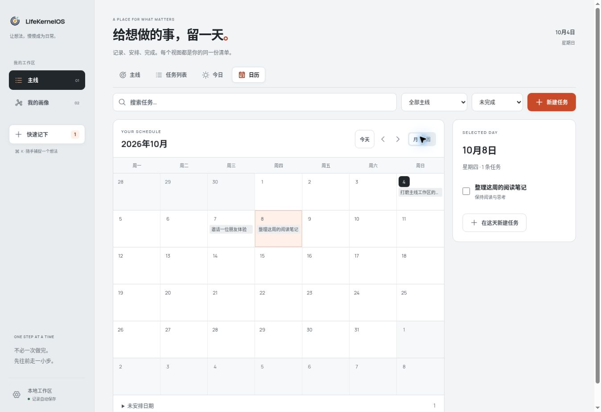

# LifeKernelOS

LifeKernelOS 是一个本地桌面行动工作区：把想法随手记下来，把主线拆成可执行的小步骤，此刻只做一件事，并把真实行动与知识留在自己的画像里。

默认客户端使用 **Electron + React + TypeScript**。打开即可用，无需登录、部署服务或联网。记录保存在本机；主线进度来自完成事实。



## 本轮产品内容

- **主线**：多个方向、任务内容、派生进度与一个全局当前行动。支持完成、拆小、卡住、恢复、放弃和暂时放下。
- **基础 Todo**：新建与编辑、直接勾选、撤销完成、可恢复移除、搜索和主线/状态筛选。
- **日期与视图**：主线内切换任务列表、今日、月历和周历；选日新建，日期可清除，未安排任务仍可访问。
- **快速记下**：不必先分类，稍后再整理到主线。完整保留最多 2000 字符。
- **我的画像**：主线、完成事实、知识、自我描述和经历的可追溯图谱。
- **桌面体验**：专注小窗、收集小窗、快捷键、自动保存、导出、确认后备份导入。
- **视觉**：冷白与石墨黑，朱橙强调当前行动和主要操作；清楚的文字层级、低噪声侧栏，完成操作留在首屏。

当前优先把基础 Todo 与日历做稳，**尚未连接运行时 AI**。之后再为产品线加入任务拆解、下一步建议与处理卡住等增强；AI 建议须由用户确认，不替用户判断人格、能力或人生优先级。体验参考见[官方产品调研](docs/product/todo-reference-products.md)。

## 启动桌面客户端

需要 Node.js 22.13 或以上，建议 Node.js 24 LTS，以及桌面图形环境。

```bash
npm ci
npm run dev
```

开发启动会自动构建 Electron 主进程并打开桌面窗口。应用只有一个 SQLite 业务进程，窗口通过受限 IPC 访问，不启动 HTTP API 服务。

使用生产资源运行：

```bash
npm run build
npm start
```

快捷键：`Cmd/Ctrl + K` 快速记下，`Cmd/Ctrl + Shift + Space` 全局收集小窗，辅助窗口 `Esc` 关闭。如果全局快捷键被占用，可从应用菜单打开。

## 数据与迁移

- 数据存于操作系统的应用 userData，包含 `lifekernel.sqlite` 与 `backups/`。设置页可打开目录。
- 每次启动和导入前生成 JSON 备份，保留最近 10 份。
- 当前导出 schemaVersion 7 JSON，包含安排日期；兼容导入 v6，旧任务日期为空。客户端会显示数量，明确确认后备份并事务替换；失败回滚。
- 导出不含密码或 Session。当前无云同步、自动升级与模型调用。

## 构建安装包

```bash
npm run package:dir  # 当前平台的应用目录，输出 release/
npm run package      # 当前平台的安装包，不自动发布
```

macOS：DMG/ZIP；Windows：NSIS；Linux：AppImage/tar.gz。各平台请在相应系统构建。main push 与 PR 自动运行三平台检查；main 检查通过后生成带 SHA-256 的未签名安装包。匹配 package.json 的 `v*` 标签在验证通过后自动发布 GitHub Release，详见 [CI/CD](docs/development/ci-cd.md)。签名与自动升级另行配置。

## 验证与当前状态

```bash
npm run docs:check
npm test
npm run build
npm run test:desktop # 真实 Electron 启动、IPC、小窗及重启测试；需要图形环境
```

PRD v0.10、ADR-0009/0010 已接受；SPEC-0012/0013 为 `Implemented`。46 项自动化回归、浏览器 Todo 闭环、类型与生产构建、Electron 内置 SQLite 数据测试通过。当前执行环境禁止 Electron 所需的 Unix socket；真实三平台启动交由 CI，**原生对话框、全局快捷键与实机安装仍待人工验收**，未标记 `Verified`。

详见 [桌面验收记录](docs/development/desktop-acceptance.md) 与 [视觉 QA](design-qa.md)。界面预览使用独立示例工作区，不会在首次桌面启动时生成示例记录：

```bash
npm run dev -- --preview
```

## 兼容 Web 入口

Fastify Web 入口保留用于旧部署，使用独立数据库与服务端账号：

```bash
LK_SEED_EMAIL="you@example.com" LK_SEED_PASSWORD="请使用自己的强密码" npm run db:seed
npm run dev:legacy
```

## 产品与协作事实源

从 [AGENTS.md](AGENTS.md) 或 [llms.txt](llms.txt) 进入，按 [文档索引](docs/README.md) 路由。[PRD](docs/product/PRD.md) 记录产品范围，[ADR-0009](docs/architecture/decisions/0009-electron-local-desktop.md) 记录桌面选择，[SPEC-0012](docs/specs/current/0012-electron-desktop.md) 和 [SPEC-0013](docs/specs/current/0013-basic-todo-and-calendar.md) 记录可验证行为。

需求先进入 PRD/ADR/Spec，再实现与验证；`Implemented` 与 `Verified` 分开记录。`sources/` 保持只读。

下一版产品方向见 [PRD v0.11 草案](docs/product/next-direction-prd.md)：简约的个人行动工作区，先验证稳定的日常 Todo，再验证事实回顾与场景 AI。草案为 `Proposed`，现有产品与界面仍按当前 Accepted 基线运行。
